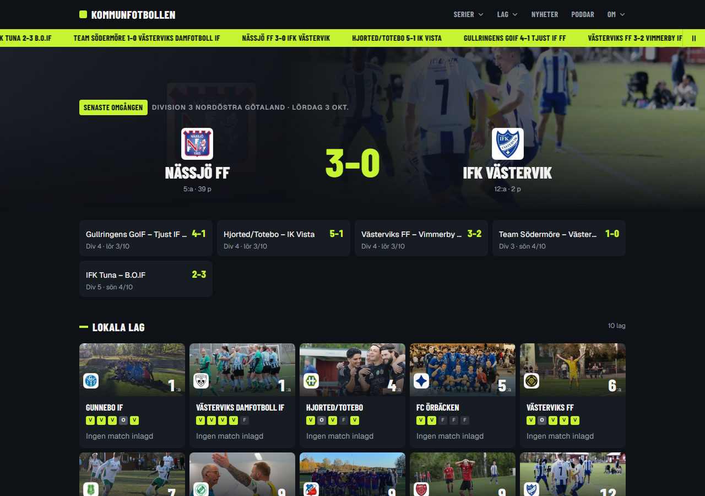
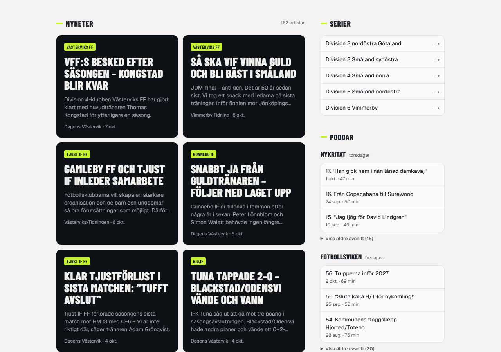
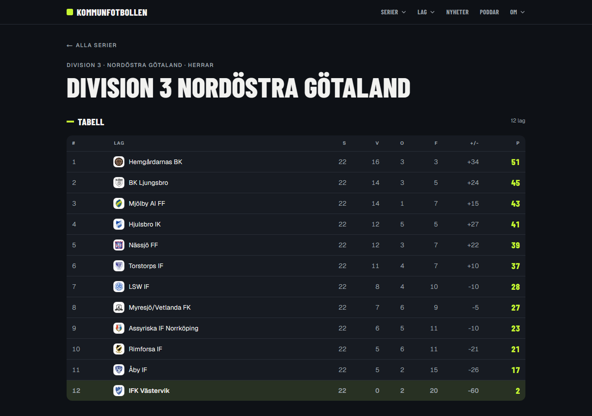

# Kommunfotbollen

Ett hyperlokalt nav för fotbollen i Västervik med omnejd: tabeller, resultat, målskyttar, nyheter och poddar — samlat på ett ställe och hållet uppdaterat helt automatiskt, utan manuell redigering.

**Live:** [kommunfotboll.onrender.com](https://kommunfotboll.onrender.com) — [systemstatus-sidan](https://kommunfotboll.onrender.com/systemstatus) visar i realtid när varje bakgrundsjobb senast kördes och hur mycket data som samlats in.

## Skärmdumpar







## Vad appen gör

- **Tabeller & matcher** — hämtas från Everysport för fem lokala serier, synkas dagligen kl 23:00.
- **Målskyttar** — Everysport saknar målskyttar på den här nivån, så appen skrapar lokaltidningarnas (Dagens Västervik, Vimmerby Tidning) matchreferat direkt och läser ut vem som gjorde mål med Claude, med matchens redan kända resultat som facit för att undvika gissningar.
- **Nyheter** — artiklar om de lokala lagen samlas in från Dagens Västervik, Vimmerby Tidning och Västerviks-Tidningen (via tidningarnas sitemaps respektive DV:s fotbollssida), med dubblettfiltrering och AI-relevansbedömning som avgör om en artikel faktiskt handlar om ett bevakat lag.
- **Poddar** — episoder från de lokala fotbollspoddarna Nykritat och Fotbollsviken.
- **Systemstatus** — en öppen vy över driften: senast körda jobb, mängd insamlad data och hur pipelinen är uppbyggd.

## AI-extraktionen i detalj

Två separata Claude-uppgifter gör att appen kan använda källor som aldrig var byggda för att vara datakällor:

- **Relevansfiltrering** — lagnamnsmatchning ger en del falska träffar (namnkrockar, artiklar om fel sport, fel ort). Claude läser varje artikel och avgör om den faktiskt handlar om ett bevakat lag, innan den visas.
- **Målskytte-extraktion** — lokaltidningarnas matchreferat är fri text, inte strukturerad data. Claude läser referatet och plockar ut vem som gjorde mål, men får matchens redan kända slutresultat som facit i prompten — modellen ska hitta namnen i texten, inte gissa fram ett resultat som redan är känt.

Båda uppgifterna är medvetet snävt avgränsade: en AI-uppgift per beslut, med explicit facit där det finns, istället för en generell "läs och sammanfatta"-prompt.

## Teknikstack

- [Next.js 16](https://nextjs.org) (App Router, Server Components)
- [Supabase](https://supabase.com) — hanterad Postgres (fri nivå)
- [Drizzle ORM](https://orm.drizzle.team)
- [Zod](https://zod.dev) för validering av extern data
- [Tailwind CSS v4](https://tailwindcss.com)
- [Claude](https://www.anthropic.com/claude) (`claude-haiku-4-5`) för relevansbedömning och målskytte-extraktion

## Arkitektur i korthet

```
Schemalagda jobb i appen (instrumentation.ts)
   nyheter 22:00 · lagen (tabeller, matcher, målskyttar) 23:00
                    │
                    ▼
Everysport, lokaltidningar (DV, Vimmerby T, VT), poddflöden
                    │
                    ▼
     AI-extraktion (Claude) — relevans & målskyttar
                    │
                    ▼
        Supabase Postgres + Drizzle
                    │
                    ▼
          Next.js Server Components
```

Appen är sin egen cron: `instrumentation.ts` hämtar nyheter/poddar kl 22:00 och allt som rör lagen (tabeller, matcher/resultat, målskyttar) kl 23:00 svensk tid. All data ligger i en extern databas, så inget går förlorat vid omstart. Appen körs på Render Free-nivån och hålls vaken av en extern ping (cron-job.org) mot `/api/health` var 5:e minut — annars somnar instansen och de schemalagda jobben stannar.

## Köra lokalt

```bash
npm install
npm run dev
```

Öppna [http://localhost:3000](http://localhost:3000).

Sätt `ANTHROPIC_API_KEY` i en `.env.local`-fil för att aktivera AI-relevansbedömning och målskytte-extraktion — utan den körs matcher/tabeller som vanligt, men nyheter/målskyttar hoppas över. Sätt även `DATABASE_URL` mot en Postgres-instans (Supabase eller lokal).

`/api/sync` kan anropas manuellt (`?target=teams` / `?target=news`, eller inget för allt) för att köra synkjobb direkt, som backup eller för felsökning — enklast via GitHub Actions-workflowen *Sync* (manuell körning). I produktion krävs `Authorization: Bearer <CRON_SECRET>` — lokalt hoppas kontrollen över om `CRON_SECRET` inte är satt.

## Bakgrund

Ett portfolioprojekt av [Alex Åhman](https://alexahman.se) — byggt för att visa upp ett komplett, källagnostiskt insamlingssystem: flera datakällor, AI-driven extraktion med strikta regler mot att gissa, och en drift som kostar noll kronor i månaden.
